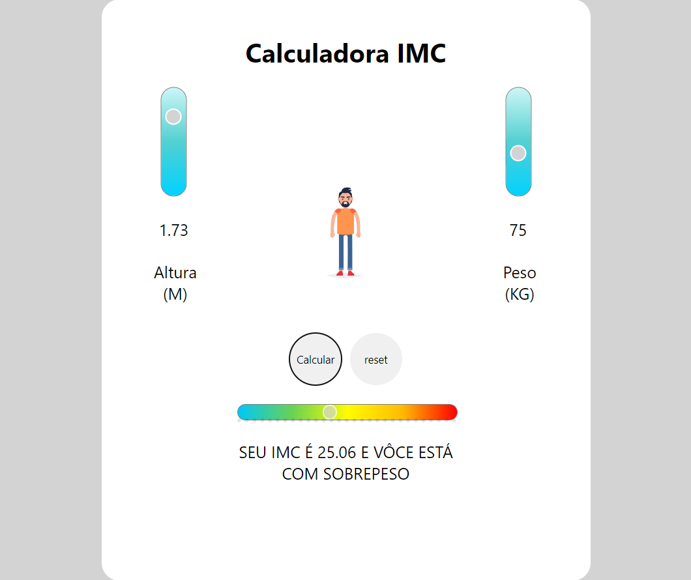

# Calculadora-IMC


Projeto é uma calculadora IMC simple onde o usuario informa o peso e altura e é retornado o valor de IMC e o Status conforme a tabela de IMC.

##### Previa Desktop


## 💻 Pré-requisitos

Antes de começar, verifique se você atendeu aos seguintes requisitos:

* Você instalou a versão mais recente de `<VS CODE>`
* Certifique-se de ter instalado a extenção Live Server no seu VS CODE.

## 🚀 Instalando <Mini E-Commerce>

Para instalar o <Calculadora-IMC>, siga estas etapas:

Abra o terminal no diretorio que voce deseja instalar o app
```
<git clone https://github.com/jumaelmartins/Calculadora-IMC.git>
```

## ☕ Usando <Calculadora-IMC>

Para usar <Calculadora-IMC>, siga estas etapas:

Com o diretorio do projeto aberto no VS CODE clique com o botão direito do mouse em cima do arquivo index.html e aperte na opção Open With Live Serve:


## 💥O que aprendi ao desenvolver esse projeto:

- Operações Basicas com JavaScript
- Manipulação de DOM

## 📫 Contribuindo para <Mini E-Commerce>

Para contribuir com <Mini E-Commerce>, siga estas etapas:

1. Bifurque este repositório.
2. Crie um branch: `git checkout -b <nome_branch>`.
3. Faça suas alterações e confirme-as: `git commit -m '<mensagem_commit>'`
4. Envie para o branch original: `git push origin <Mini E-Commerce> / <local>`
5. Crie a solicitação de pull.

Como alternativa, consulte a documentação do GitHub em [como criar uma solicitação pull](https://help.github.com/en/github/collaborating-with-issues-and-pull-requests/creating-a-pull-request).
